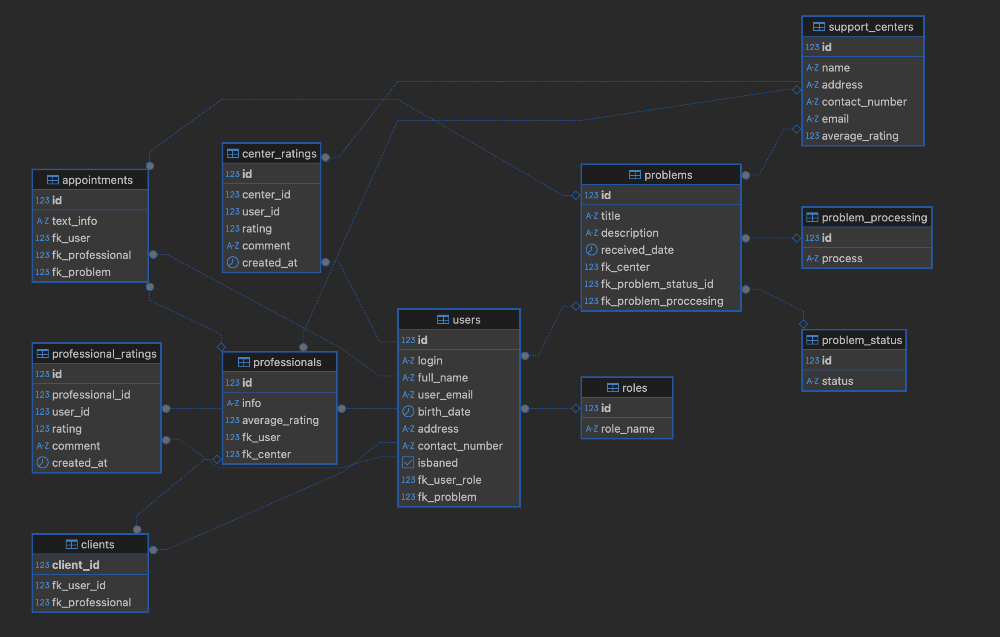

# Обзор базы данных

## Диаграмма



## Sql код

```sql
CREATE TABLE roles (
    id bigserial NOT NULL PRIMARY KEY,
    role_name varchar(50)
);

CREATE TABLE problem_status (
    id bigserial NOT NULL PRIMARY KEY,
    status varchar(50) NOT NULL DEFAULT 'Minor'
);

create table problem_processing(
    id bigserial NOT NULL PRIMARY KEY,
    process varchar(50) NOT NULL DEFAULT 'idle'
);

CREATE TABLE support_centers (
    id bigserial NOT NULL PRIMARY KEY,
    name varchar(50) NOT NULL,
    address varchar(100) NOT NULL,
    contact_number varchar(15) NOT NULL,
    email varchar(50),
    avatar bytea not null,
    average_rating DECIMAL(3,2) DEFAULT null
);

CREATE TABLE problems (
    id bigserial NOT NULL PRIMARY KEY,
    title varchar(20) not null,
    description text NOT NULL,
    received_date date not null,
    fk_center int references support_centers(id) on delete cascade,
    fk_problem_status_id int REFERENCES problem_status(id) ON DELETE cascade,
    fk_problem_proccesing int REFERENCES problem_processing(id) ON DELETE cascade
);


CREATE TABLE users (
    id bigserial NOT NULL PRIMARY KEY,
    login varchar(50) NOT NULL,
    password varchar(50) not null,
    full_name varchar(100) NOT NULL,
    email varchar(50) NOT NULL,
    birth_date date NOT NULL,
    address varchar(100) NOT NULL,
    contact_number varchar(15) NOT NULL,
    avatar bytea,
    isBaned boolean not null default false,
    fk_user_role int REFERENCES roles(id) ON DELETE CASCADE,
    fk_problem int REFERENCES problems(id) ON DELETE cascade
);

CREATE TABLE professionals (
    id bigserial PRIMARY KEY,
    info TEXT not null,
    average_rating DECIMAL(3,2) DEFAULT NULL,
    fk_user int NOT NULL UNIQUE REFERENCES users(id) ON DELETE CASCADE,
    fk_center int REFERENCES support_centers(id) ON DELETE CASCADE
);

create table center_employee(
	id bigserial PRIMARY KEY,
    fk_user int NOT NULL UNIQUE REFERENCES users(id) ON DELETE CASCADE,
    fk_center int REFERENCES support_centers(id) ON DELETE CASCADE
);

CREATE TABLE clients (
    client_id bigserial PRIMARY KEY,
    fk_user_id int NOT NULL UNIQUE REFERENCES users(id) ON DELETE CASCADE,
    fk_professional int REFERENCES professionals(id) ON DELETE SET NULL
);

CREATE TABLE appointments (
    id bigserial NOT NULL PRIMARY KEY,
    text_info text NOT null,
    fk_user int NOT NULL REFERENCES users(id) ON DELETE CASCADE,
    fk_professional int REFERENCES professionals(id) ON DELETE SET NULL,
    fk_problem int REFERENCES problems(id) ON DELETE cascade
);


CREATE TABLE center_ratings (
    id bigserial NOT NULL PRIMARY KEY,
    center_id bigint NOT NULL REFERENCES support_centers(id) ON DELETE CASCADE,
    user_id bigint NOT NULL REFERENCES users(id) ON DELETE CASCADE,
    rating smallint NOT NULL CHECK (rating BETWEEN 1 AND 5),
    comment text,
    created_at timestamp NOT NULL DEFAULT CURRENT_TIMESTAMP,
    UNIQUE (center_id, user_id) 
);


CREATE TABLE professional_ratings (
    id bigserial NOT NULL PRIMARY KEY,
    professional_id bigint NOT NULL REFERENCES professionals(id) ON DELETE CASCADE,
    user_id bigint NOT NULL REFERENCES users(id) ON DELETE CASCADE,
    rating smallint NOT NULL CHECK (rating BETWEEN 1 AND 5),
    comment text,
    created_at timestamp NOT NULL DEFAULT CURRENT_TIMESTAMP,
    UNIQUE (professional_id, user_id) 
);

```

## Вставка первичных данных

```sql
-- Статусы решения проблемы
INSERT INTO problem_processing (process) VALUES 
('idle'),
('processing'),
('fulfilled'),
('rejected');

-- Роли
INSERT INTO roles (role_name) VALUES 
('CITIZEN'),
('CENTER'),
('PROFESSIONAL'),
('ADMIN');

-- Статусы проблем
INSERT INTO problem_status (status) VALUES 
('EXTRA HIGH'),
('HIGH'),
('MEDIUM'),
('LOW'),
('MINOR');
```
